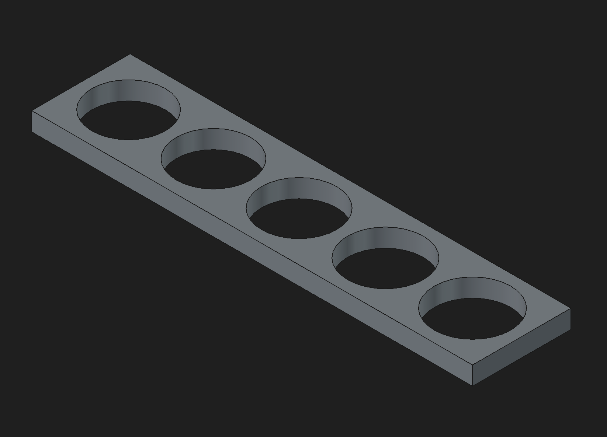

# Printer Hole Calibration

These instructions are for slic3r forks. I have only tested on BambuStudio.

1. Print `PHC-test_jig.3mf` using your slicer's default settings
2. Measure the diameter of the holes with a caliper set to measure mm
3. Run calibration script as follows:
```
$(which python3) calibrate.py result1 result2 ... result5
```
Note: The order of results should be put in the order of smallest hole to
largest from the expected results.
4. Set the `Quality` -> `Precision` -> `X-Y hole/contour compensation` to the
output of the script

### Example Run:

```
python3 calibrate.py 9.86 10.01 10.14 10.17 10.26
[*] expected 10.00 - result 9.86
[*] expected 10.10 - result 10.01
[*] expected 10.20 - result 10.14
[*] expected 10.30 - result 10.17
[*] expected 10.40 - result 10.26
X-Y hole/contour compensation: 0.05600000000000005 (Radius)
```

### Test Jig Image


